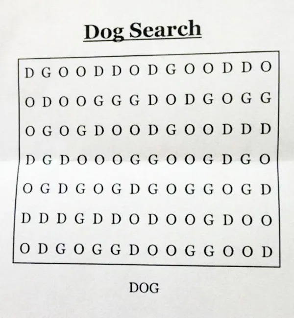

# Doggo Search

I couldn't for the life of me find 'DOG' in this puzzle, then I saw that people
even found 'DOGGO'. This is an (over-engineered) solution in Rust to find
'DOGGO'.



# Running

```bash
git clone https://github.com/cbebe/doggosearch
cd doggosearch
cargo run --release
```

<details>
  <summary>Result (Spoiler!!)</summary>

It's (1-indexed) column 8, row 3, going down and to the right.

I almost didn't believe that it was actually there until it printed
`Found DOGGO in Cell(2, 7), DownRight`

</details>
